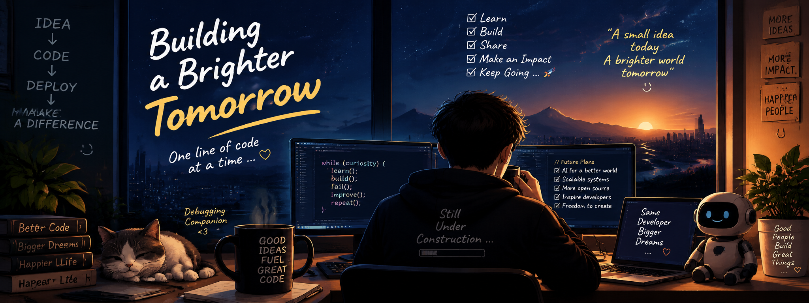

<div align="center">
  
  
  
<h1 align="center">👋 Hi there, I'm the person who argues with bugs at 2 AM ☕🐛</h1>

<p align="center">
  
</p>

<p align="center">
  
  
  
</p>

---

### 🌎 About Me

My developer journey has been a long conversation between **curiosity** and **failure**.

I've broken things. I've fixed things. I've rewritten code I was proud of yesterday — because today I know a better way. 😄

> Every error message has taught me **patience**.
> Every difficult project has taught me **creativity**.
> Every "impossible" problem has reminded me why I love **building**.

For me, coding isn't just a job.
It's my way of exploring the world, solving puzzles, and leaving small pieces of my imagination behind. 🌎

---

### 🚀 Current Mission

<p>
Build software that is not only <b>functional</b>, but <b>meaningful</b>.<br>
Create systems that can handle millions of users, help people work smarter, and make technology feel a little more human.
</p>

I'm especially excited about the future of:

<table>
  <tr>
    <td align="center">🤖<br><b>Artificial Intelligence</b></td>
    <td align="center">☁️<br><b>Cloud & Distributed Systems</b></td>
    <td align="center">⚡<br><b>Automation</b></td>
    <td align="center">🧠<br><b>Intelligent Products</b></td>
  </tr>
</table>

---

### 🌱 My Dream

<p align="center">
  <em>"I didn't just write code. I built things that mattered."</em>
</p>

I want to create technology that helps people, inspires other developers, and proves that a small idea from one person can grow into something much bigger.

---

### 🎮 Life as a Developer

```
Level 1 : Learn the syntax ✅
Level 2 : Fight the bugs 🐛✅
Level 3 : Understand the architecture 🏗️✅
Level 4 : Build something amazing 🚀🔄
Level 5 : Repeat forever 🔁♾️
```

And honestly... I kind of like this game. 😎

---

<h3 align="center">⭐ Keep learning. 🔥 Keep building. 🌌 Keep dreaming.</h3>

<p align="center">
  
</p>

  
  
  <br><br>
  
</div>
